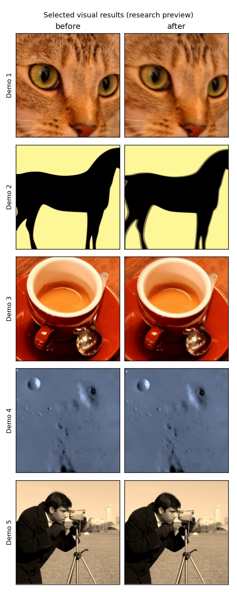
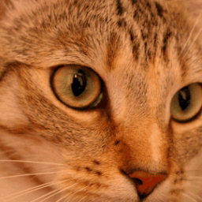
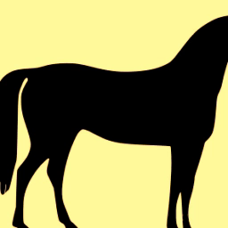
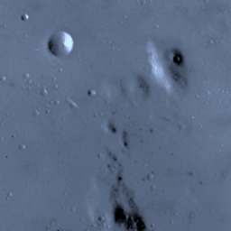

# Quantum-Inspired Video Temporal Control — Selected Results

Selected visual results from a **private research prototype** exploring
**temporal consistency and motion coherence** for video generation and editing.

  

> Real or real-looking visual demos. &nbsp;·&nbsp; Private implementation. &nbsp;·&nbsp; Public teaser only.

## Visual previews

| Demo | Preview | Videos |
|---|---|---|
| Demo 1 |  | [before](media/demo1_before.mp4) · [after](media/demo1_after.mp4) |
| Demo 2 |  | [before](media/demo2_before.mp4) · [after](media/demo2_after.mp4) |
| Demo 3 |  | [before](media/demo3_before.mp4) · [after](media/demo3_after.mp4) |
| Demo 4 |  | [before](media/demo4_before.mp4) · [after](media/demo4_after.mp4) |
| Demo 5 |  | [before](media/demo5_before.mp4) · [after](media/demo5_after.mp4) |

## What this repository is

This repository is a public teaser for a private research prototype. It contains
selected visual outputs only. The technical implementation is not publicly released.

## What is included

- Short before/after MP4 demos.
- GIF previews for quick viewing on GitHub.
- A small visual gallery.
- A high-level non-technical summary ([RESULTS_SUMMARY_NON_ENABLING.md](RESULTS_SUMMARY_NON_ENABLING.md)).

## What is intentionally not included

- No source code.
- No formulas.
- No technical diagrams.
- No training details.
- No model checkpoints.
- No private reports.
- No evaluation tables.
- No implementation details.

## Research status

These demos are early research previews. They are not a product, not a benchmark
result, and not a state-of-the-art result. The goal of this public page is simply
to show selected visual outputs from an ongoing private research direction.

No advantage of any kind is asserted.

## Portfolio

Part of my research portfolio → [chen-quantum.github.io/projects](https://chen-quantum.github.io/projects)

## Contact

Chen Gadi
chengadi@mail.tau.ac.il
